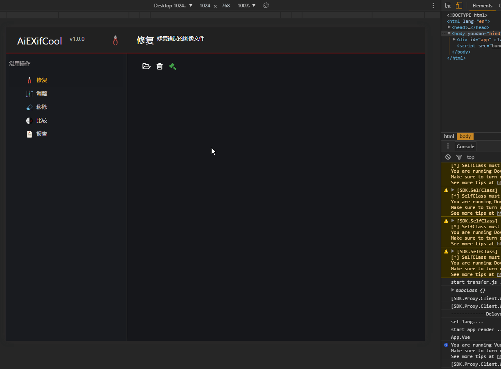

# AiEXifCool
AiEXifCool  高级图像EXIF处理工具

用Vue.js、Vue-router、Vue-i18n、Keen-ui、Webpack、Webpack-dev-server 和 dove.max.sdk 编写的针对macOS系统(苹果操作系统)的工具类软件。
将会像我们其他类产品一样，发布到苹果应用商店中，进行销售！ ^_^

> 如果对您有帮助，您可以点右上角 "Star" 支持一下 谢谢！ ^_^


<p><a href="//wpa.qq.com/msgrd?v=3&uin=34314687&site=qq&menu=yes">QQ交流 <strong> 34314687 </strong></a></p>


##### 环境
 1. node v6.x
 2. cnpm 4.x
 3. npm 3.10.x

##### 技术栈

> [vue](https://github.com/vuejs/vue)

> [vue-router](https://github.com/vuejs/vue-router)

> [vue-i18n](https://kazupon.github.io/vue-i18n/)

> [keen-ui](https://github.com/JosephusPaye/Keen-UI)

> [dove.max.sdk](https://github.com/LabsRS-Dev/sdk)

> [webpack](http://webpack.github.io/docs/)

> [webpack-dev-server](https://github.com/webpack/webpack-dev-server)

> [es6-babel](https://babeljs.io/docs/learn-es2015/)

---
### 截图



### 安装
项目地址：（使用`git clone`）

```shell
git clone https://github.com/LabsRS-Dev/AiEXifCool.git
```

通过`npm`安装本地服务第三方依赖模块(需要已安装[Node.js](https://nodejs.org/))，使用npm安装依赖模块可能会很慢，建议换成[cnpm](http://cnpmjs.org/)

```shell
npm install -g cnpm --registry=http://registry.npm.taobao.org
```

```bash
# 安装依赖模块
cnpm install

# 启动服务测试
npm run dev

# 发布代码
npm run build

```

### 开发

### 目录结构
<pre>
.
├── README.md
├── dist                     // 项目build目录
├── config                   // 环境变量和入口，出口配置
├── docs                     // 文档目录
├── static                   // 静态资源目录
├── build                    // 项目的配置文件目录
├── package.json             // 项目配置文件
├── src                      // 生产目录

.
</pre>

------------
